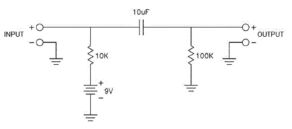
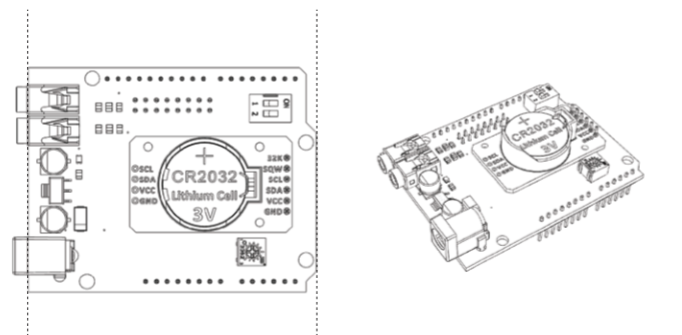

This is the hardware section of the OFR project, here we'll talk you through all the components and process involved in building and assembling your own OFR system. Currently it may not be feasible for you to build your own as we may be missing resourcecs or info but this is a living project so we will keep it updated.

# What does the OFR run on?:

The brains of the OFR system in the [Spresense](https://developer.sony.com/develop/spresense/specifications) board by Sony so you will need one of these before you can do anything else.

in the UK you can get them from [RS](https://uk.rs-online.com/web/p/processor-microcontroller-development-kits/1783376/)

In theory that woud be all you need to get started using the cheap on board NEN mic but with the OFR part of what we wanted was the achieve audio as close as possible to what we get with our traditional field recorders.

As such we have designed the OFR to run in stereo with two omni microphones. The full spec is th two [DPA 4060s](https://www.dpamicrophones.com/lavalier/4060-series-miniature-omnidirectional-microphone) these are almost industry standard when it comes to field recording and are used by all the greats, obviously with a cost overhead. More affordable would be two [primo capsules](https://micbooster.com/primo-microphone-capsules/8-primo-em172.html). 

If using the the DPA 4060s you will need phnatom power. Although techncially 48v the mics themselves only need 9v so using this little  bit of circuitry will let you run your two DPA straight into the Spresense.

If using the Primos then no need for phantom power.

This in theory is all you would need to get a OFR system running - the board and mics. The board has GPS inbuilt and all you need is an SD card.

To record outside you will of course need an enclosure. There are a lot of poptions out there. We have a design for a very robust build designed for highly unhospitable environments. its based around the [cases by peli](https://uk.rs-online.com/web/p/flight-cases-equipment-cases/2974874?cm_mmc=UK-PLA-DS3A-_-google-_-CSS_UK_EN_Enclosures+%26+Storage+%26+Material+Handling_Whoop-_-Flight+Cases+%26+Equipment+Cases_Whoop-_-PRODUCT_GROUP&matchtype=&pla-335724086825&gclid=Cj0KCQjw09HzBRDrARIsAG60GP8JtoMHj0XwgZ-PGZZ_YGvNpNV9A3JKfgx7ELQWGfxBY-CfXVgkZT0aAnXtEALw_wcB&gclsrc=aw.ds) and when it comes to weather proofing you do get what you pay for. 

We will put together a comprehensive list of instructions with images and step by step assembly guide soon.

# Shield:

The OFR shield is our new and exciting development in the OFR. Its built with our friends over at Digital Nativ and is designed to increase botht he robustness of the recorder in the field and the speed at which new builds can get up and running. It does this by minimising the amount of assembly but also the amount of loose and moving parts in the final assembly, meaning less to get knowcked and corroded.

The shield will further provide you with tangible physical controls over some key parameters such as Gain, Audio Qualilty and toggling the GPS on and off for indoor or outdoor use.

The current international situation has sloweed down the development of the board but we expect to have prototype builds out late summer 2020 and have a limited amount available for sale laste 2020.

